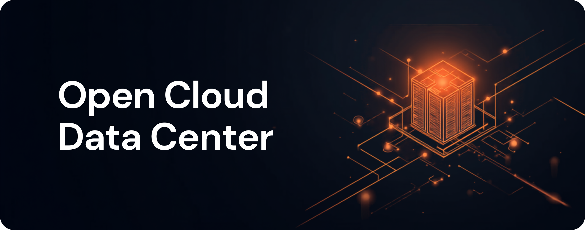
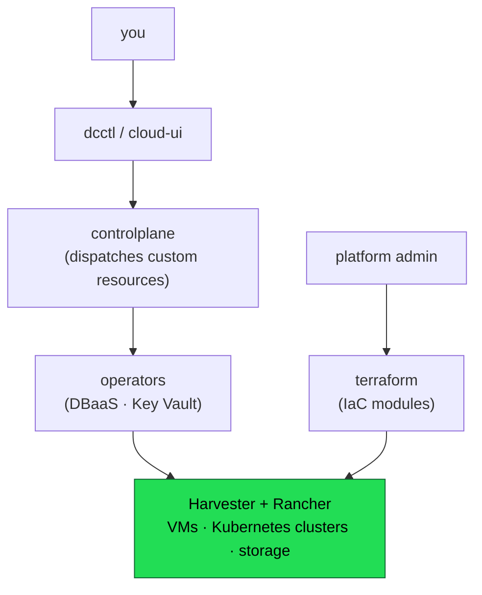

  

# Open Cloud Data Center (OCD)

Turn an on-prem datacenter into a self-service cloud. OCD is an open, modular control plane and module set for running compute, Kubernetes clusters, and networking on your own hardware — without public-cloud lock-in.

- **Sovereignty** — full control over your data and infrastructure.
- **Portability** — move workloads across on-prem hardware and providers.
- **Cost-efficiency** — optimize resource usage and avoid vendor lock-in.
- **Community-driven** — built on open standards and collaborative development.

> ℹ️ **This `main` branch is the index — it carries no code.** Each layer of the
> stack lives on its own branch, mapped below; `main` is intentionally kept as
> the front door + roadmap, not a place to build from.

## Architecture

Two paths to provision a resource, one platform underneath:

- **Self-service path** — `dcctl` (CLI) or `cloud-ui` (web) talk to `controlplane`'s DC-API, which dispatches custom resources that the `operators` reconcile into real VMs on Harvester.
- **Infrastructure path** — a platform admin applies `terraform` modules directly against Harvester + Rancher to stand up or operate the platform itself — including deploying the operators and the control plane's own hosting cluster.

## `terraform` — infrastructure as code

The foundation everything else builds on: modules that wrap the Harvester + Rancher providers to stand up the platform (Rancher, networking, storage, identity, monitoring), onboard tenants (projects, quotas, VMs, clusters), and optionally deploy the operators and the control-plane's hosting infrastructure.

→ [`github.com/wso2/open-cloud-datacenter/tree/terraform`](https://github.com/wso2/open-cloud-datacenter/tree/terraform)

## `operators` — platform services

Kubernetes operators that turn Harvester capacity into managed, as-a-service resources — **Database** (PostgreSQL) and **Key Vault** today, more landing alongside. Each is a self-contained kubebuilder project that reconciles custom resources dispatched by the control plane into real VMs on Harvester.

→ [`github.com/wso2/open-cloud-datacenter/tree/operators`](https://github.com/wso2/open-cloud-datacenter/tree/operators)

## `controlplane` — the self-service cloud experience

A REST API (**DC-API**), a CLI (**dcctl**), and a web console (**cloud-ui**) that turn the raw platform into a cloud-like experience — provision VMs and Kubernetes clusters with a single command, no Terraform knowledge required.

The same control plane, two ways — provisioning a virtual network from the **CLI** or the **web console**:

<table>
<tr>
<td width="50%" valign="top"><strong><code>dcctl</code> — CLI</strong>  </td>
<td width="50%" valign="top"><strong>Web console</strong>  </td>
</tr>
</table>

→ [`github.com/wso2/open-cloud-datacenter/tree/controlplane`](https://github.com/wso2/open-cloud-datacenter/tree/controlplane)

## Reporting issues

Found a bug or have a feature request? Use the [issue templates](.github/ISSUE_TEMPLATE)
on this repo — bug reports and feature/improvement requests are triaged
separately from general questions. Issues that apply to a specific layer
(e.g. a Terraform module, an operator) are still filed here; mention the
relevant branch in the report.

## Contributing

Contributions are welcome on every branch. Start with
[`docs/CONTRIBUTING.md`](docs/CONTRIBUTING.md) for the workflow, and the
[pull request template](pull_request_template.md) for what a good PR looks
like here. Please read [CODE_OF_CONDUCT.md](CODE_OF_CONDUCT.md) before
participating.

## License

Licensed under the terms in [LICENSE](LICENSE). See also [CODE_OF_CONDUCT.md](CODE_OF_CONDUCT.md).
