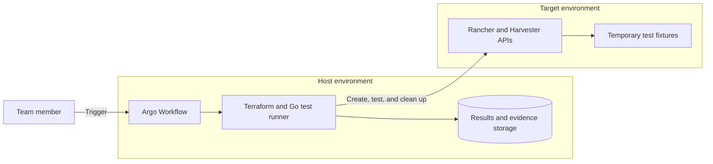

# Harvester Upgrade Test Suite

The Harvester Upgrade Test Suite is a reusable acceptance-testing pipeline for
validating the Harvester and Rancher capabilities that Open Cloud Datacenter
depends on after an upgrade or configuration change.

> **Project status:** Early development. The first milestone is establishing the
> pipeline infrastructure and implementing **CAP-002: Tenant Space** as the
> reference capability. The suite is not yet ready for production use.

This project lives on the `testsuite` branch. The branch is maintained as a
self-contained project with its own code, infrastructure, documentation, and
release history.

## Goals

- Run repeatable acceptance tests against a Harvester environment.
- Keep the test runner and its evidence available when the target fails.
- Create temporary test fixtures and reliably clean them up.
- Verify observable behavior, not only successful infrastructure provisioning.
- Produce portable JUnit, JSON, log, and evidence outputs.
- Let teams develop, submit, and validate each capability workflow independently.
- Allow capabilities to be added without redesigning shared pipeline components.
- Provide development and production-ready deployment references for community
  environments.

## Architecture

The suite separates the system running the pipeline from the system under test:

- **Host environment:** A Harvester and Rancher environment containing a
  downstream Kubernetes cluster. Argo Workflows, test runner pods, and artifact
  storage run in this cluster.
- **Target environment:** The Harvester environment being tested. Only temporary,
  uniquely named test resources are created here.



Workflow pods do not run in the Target environment. They access approved Target
APIs remotely using scoped credentials stored in the Host environment. This
separation keeps diagnostics, test results, and cleanup facilities available
when a Target capability is degraded.

## Technology stack

| Technology | Responsibility |
|---|---|
| Argo Workflows | Orchestrates the test lifecycle in Kubernetes |
| Terraform | Creates and removes temporary test fixtures |
| Go | Implements API clients, behavioral checks, and evidence collection |
| Ginkgo v2 and Gomega | Structures capability tests and asynchronous assertions |
| Kubernetes `client-go` and dynamic client | Accesses Kubernetes and Harvester APIs and CRDs |
| JUnit and JSON | Provides portable test and automation results |
| S3-compatible object storage | Retains workflow artifacts and evidence; MinIO is used by the development setup |
| Kubernetes persistent storage | Shares Terraform state and the saved plan between CAP-002 workflow steps |

## Capability workflow lifecycle

The complete test suite will use the bounded lifecycle below. CAP-002 currently
implements configuration preparation, Terraform provisioning, sanitized
Terraform evidence publication, and Terraform cleanup; each remaining stage
will be added as a separate milestone.

1. Validate Target connectivity, versions, capacity, and required inputs.
2. Acquire an environment lock to prevent conflicting runs.
3. Provision uniquely named temporary fixtures with Terraform.
4. Run Go acceptance tests against the Target APIs and resources.
5. Publish JUnit, structured JSON, logs, and relevant Kubernetes evidence.
6. Run Terraform cleanup even when provisioning or assertions fail.
7. Let a scheduled janitor retry cleanup of expired resources after exceptional
   failures.

Terraform owns the fixture lifecycle. The Go test layer proves that the
resulting capability behaves correctly.

## First milestone: CAP-002 Tenant Space

The first CAP-002 phase provisions one configured development tenant and
exercises:

- Rancher project creation.
- Workload and network namespace creation.
- Namespace-to-project labels.
- Project quota configuration.
- A protected zero-quota network namespace.
- Harvester VLAN network configuration.
- Expected project role bindings.

This phase proves the Terraform provisioning and destruction paths through Argo.
An exit handler always attempts cleanup, publishes sanitized plan, applied-state,
and cleanup evidence, and Argo deletes the per-workflow state PVC after a fully
successful run. Automated failed-run recovery, quota enforcement,
reconciliation, and negative-path assertions are later milestones.

The initial scenario covers a tenant with quota. Tenant-without-quota and deeper
network and RBAC scenarios can be added without changing other capability
workflows.

## Capability contract

Each capability is an independent module:

```text
capabilities/tenant-space/
├── capability.yaml
├── scripts/                  # Container step implementations
├── workflow/
│   └── workflow-template.yaml
├── fixtures/
├── tests/
└── evidence.yaml
```

Directory names are readable capability names; `capability.yaml` retains stable
IDs such as `CAP-002`. The metadata declares the capability ID, priority,
labels, timeout, required inputs, lock scope, workflow reference, and expected outputs. The
capability-owned `WorkflowTemplate` can be submitted without a suite-wide
orchestrator, allowing teams to develop and test modules in parallel. Every
capability publishes the same result contract:

```text
results/
├── junit.xml
└── result.json
evidence/
logs/
```

Adding a capability requires only a self-contained module, not changes to other
capability workflows or a hand-maintained central catalog. A future aggregate
workflow will discover capability metadata and execute all selected workflows
for a complete suite run.

## Repository layout

```text
.
├── capabilities/        # Independent capability fixtures and acceptance tests
├── cmd/                 # Test-suite command entry points
├── docs/                # Architecture, setup, operations, and authoring guides
├── infra/               # Host infrastructure and Argo/MinIO configuration
│   ├── development/     # Small-footprint development reference
│   └── production/      # Production reference, added after the dev setup is proven
├── internal/            # Shared Go clients, assertions, locking, and evidence code
├── pipeline/            # Shared workflow components and future aggregate runner
├── CONTRIBUTING.md
├── LICENSE
└── README.md
```

The development infrastructure will document the current Argo Workflows and
MinIO-based setup. The production reference will add appropriate availability,
durability, secret-management, network-policy, and operational controls after
the first vertical slice has been validated.

## Getting started

Clone only the test-suite project branch:

```bash
git clone --branch testsuite --single-branch \
  https://github.com/wso2/open-cloud-datacenter.git \
  harvester-upgrade-test-suite
cd harvester-upgrade-test-suite
```

The completed development setup will require:

- A Host Harvester and Rancher environment.
- A downstream Kubernetes cluster for workflow execution.
- Argo Workflows.
- S3-compatible artifact storage, with MinIO as the development reference.
- Network access from workflow pods to the approved Target APIs.
- Scoped Harvester, Rancher, and Kubernetes credentials stored as Host secrets.

Bootstrap and execution commands will be documented as the infrastructure and
runner are added. Until then, this repository describes the agreed architecture
and development contract rather than a runnable release.

## Security boundaries

- Never commit Target credentials, kubeconfigs, Terraform variable files,
  Terraform state, saved plans, or generated evidence containing secrets.
- Store credentials in the Host secret store, not in workflow parameters.
- Grant workflow service accounts only the permissions required by a capability.
- Restrict workflow egress to approved Target APIs, Git, the image registry, and
  artifact storage.
- Submit approved workflow templates instead of arbitrary workflow definitions.
- Use unique run IDs, execution deadlines, reserved test networks, and
  environment-level locking.
- Keep Terraform state isolated from artifacts. CAP-002 stores local state on a
  per-workflow development PVC, deletes it after successful cleanup, and retains
  it when the workflow fails.

## Roadmap

1. Establish the development Host infrastructure with Argo Workflows and MinIO.
2. Build the shared workflow components, runner image, result contract, and
   cleanup guarantees.
3. Implement CAP-002 Tenant Space as the first independently runnable workflow.
4. Add environment locking, evidence collection, and the cleanup janitor.
5. Add further Harvester capabilities as independent workflows.
6. Introduce an aggregate workflow that discovers and runs the capability set
   for an initial suite release.
7. Document and validate a production deployment model.

The architecture proposal and design discussion are tracked in
[GitHub Discussion #242](https://github.com/wso2/open-cloud-datacenter/discussions/242).

## Related project branches

Open Cloud Datacenter currently maintains major projects as separate branches
in the same repository:

- [`terraform`](https://github.com/wso2/open-cloud-datacenter/tree/terraform):
  reusable Harvester and Rancher infrastructure modules.
- [`operators`](https://github.com/wso2/open-cloud-datacenter/tree/operators):
  Kubernetes operators backing platform services.
- [`controlplane`](https://github.com/wso2/open-cloud-datacenter/tree/controlplane):
  API, CLI, and web control-plane components.

The test suite may consume released infrastructure modules, but it does not
duplicate their implementation.

## Contributing

See [CONTRIBUTING.md](CONTRIBUTING.md). Changes for this project must target the
`testsuite` branch.

## License

Licensed under the terms in [LICENSE](LICENSE). See
[CODE_OF_CONDUCT.md](CODE_OF_CONDUCT.md) for community participation guidelines.
