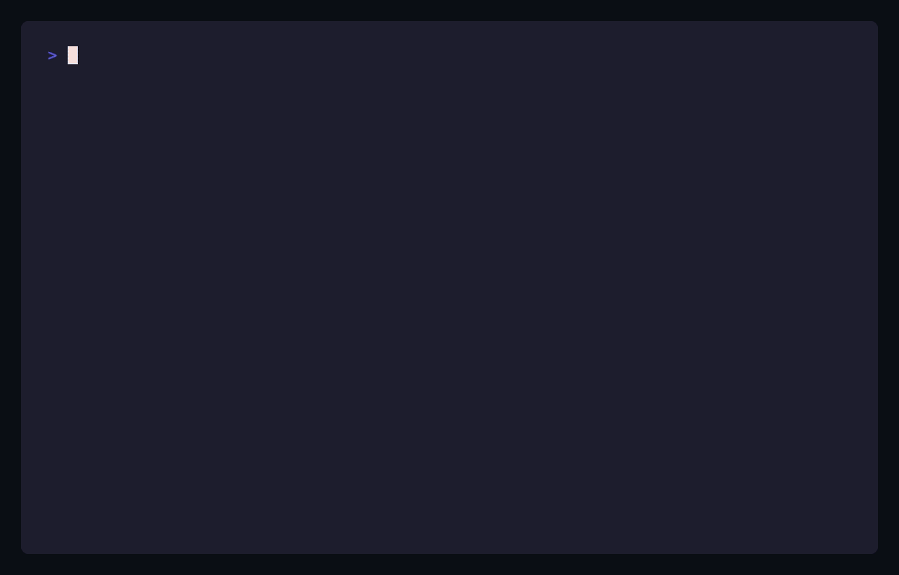

<p align="center">
  
</p>

# Open Cloud Datacenter (OCD)

[](LICENSE)
[](https://github.com/wso2/open-cloud-datacenter/issues)
[](docs/CONTRIBUTING.md)

Turn an on-prem datacenter into a self-service cloud. OCD is an open, modular control plane and module set for running compute, Kubernetes clusters, and networking on your own hardware — without public-cloud lock-in.

- **Sovereignty** — full control over your data and infrastructure.
- **Portability** — move workloads across on-prem hardware and providers.
- **Cost-efficiency** — optimize resource usage and avoid vendor lock-in.
- **Community-driven** — built on open standards and collaborative development.

> ℹ️ **This `main` branch is the index — it carries no code.** Each layer of the
> stack lives on its own branch, mapped below; `main` is intentionally kept as
> the front door + roadmap, not a place to build from.

## See it in action

The same control plane, two ways — provision a virtual network from the **CLI** or the **web console**:

<table>
<tr>
<td width="50%" valign="top"><strong><code>dcctl</code> — CLI</strong><br/><br/></td>
<td width="50%" valign="top"><strong>Web console</strong><br/><br/></td>
</tr>
</table>

## How this repo is organized

```text
              ┌─────────────────────────────────────────────┐
              │          Open Cloud Datacenter (OCD)         │
              │   turn an on-prem datacenter into a cloud    │
              └───────────────────────┬─────────────────────┘
                          branch = layer of the stack
      ┌───────────────────────────────┼───────────────────────────────┐
      ▼                               ▼                               ▼
┌──────────────┐              ┌──────────────────┐            ┌────────────────┐
│  terraform   │   Phase 1    │   controlplane   │  Phase 2   │   operators    │
│  IaC modules │   Platform   │  DC-API · dcctl  │  Cloud     │  K8s operators │
│  Harvester + │   Foundation │  cloud-ui (web)  │  Control   │  DBaaS, Key    │
│  Rancher,    │ ─ consumed ─▶│  REST/CLI/UI     │◀─ backed ─ │  Vault, …      │
│  net/backup/ │     by       │  cloud facade    │     by     │                │
│  monitoring  │              │                  │            │                │
└──────────────┘              └──────────────────┘            └────────────────┘
      ▲
      └─ main (this branch): index + roadmap only — no code

  request flow:  user → dcctl / cloud-ui → DC-API → Harvester (VMs)
                                                   → Rancher (clusters)
                                                   → operators · PostgreSQL (state)
```

| Branch | Phase | What's here |
|---|---|---|
| **[`terraform`](https://github.com/wso2/open-cloud-datacenter/tree/terraform)** | Phase 1 — Platform Foundation | Terraform / IaC modules wrapping the Harvester + Rancher providers: tenancy, networks, backup, monitoring. Start here to provision the platform. |
| **[`controlplane`](https://github.com/wso2/open-cloud-datacenter/tree/controlplane)** | Phase 2 — Cloud Control Plane | The cloud facade — **DC-API** (REST), **dcctl** (CLI), **cloud-ui** (web). Detailed plan in [`MILESTONES.md`](https://github.com/wso2/open-cloud-datacenter/blob/controlplane/MILESTONES.md). |
| **[`operators`](https://github.com/wso2/open-cloud-datacenter/tree/operators)** | Supporting | Kubernetes operators (Database, Key Vault, …) that back the control-plane services. |
| `main` | — | This index + roadmap. No code. |

## Getting started

Where you start depends on what you're trying to do — each branch is a
self-contained checkout with its own build/run instructions:

- **Provision the base platform** (Harvester + Rancher, networking, backup,
  monitoring) → checkout [`terraform`](https://github.com/wso2/open-cloud-datacenter/tree/terraform)
  and follow its module docs. Start here if nothing exists yet.
- **Drive the platform through a cloud-like API/CLI/UI** instead of raw
  Terraform → checkout [`controlplane`](https://github.com/wso2/open-cloud-datacenter/tree/controlplane)
  (`dcctl`, `cloud-ui`, DC-API).
- **Work on a specific platform service** (Database, Key Vault, …) → checkout
  [`operators`](https://github.com/wso2/open-cloud-datacenter/tree/operators).

```bash
git clone https://github.com/wso2/open-cloud-datacenter.git
cd open-cloud-datacenter
git checkout terraform   # or controlplane / operators — pick the layer you need
```

## Roadmap

### Phase 1 — Platform Foundation · `terraform`

- **Tenancy & identity** — tenant isolation; Asgardeo OIDC claim-based RBAC (no local Rancher users); per-tenant quotas (CPU / memory / storage) at the project and namespace level.
- **Terraform modules** — wrap the Harvester & Rancher providers for easy provisioning; modules to provision database instances.
- **Network abstraction** — VLAN-backed networks in Harvester; load-balancer services via kube-vip with per-environment IP pools.
- **Backup** — etcd backups to object storage; full Kubernetes backup via Velero.
- **Monitoring** — a single Grafana stack covering Harvester HCI and tenant clusters; Alertmanager routing.

### Phase 2 — Cloud Control Plane · `controlplane`

Phase 1 gives tenants a Terraform-consumable sandbox; Phase 2 delivers a **cloud experience** — a REST API (DC-API), a CLI, and eventually a portal — that abstracts away Harvester, Rancher, and Kubernetes. The interface resembles a public cloud, with the Phase 1 platform as the backend. Detailed milestones live in [`MILESTONES.md`](https://github.com/wso2/open-cloud-datacenter/blob/controlplane/MILESTONES.md).

- **M1 — Compute & cluster provisioning API** — a facade API for provisioning compute and Kubernetes clusters.
- **M1.5 — Full RBAC** — integrate an external identity provider.
- **M2 — Storage & networking** — network load balancers; a Kube-OVN virtual-network model (VPC, default gateway, DHCP, DNS); Longhorn-based storage.
- **M3 — Platform services (as-a-Service)** — **Database**, **Key Vault**, **Registry**, and **Cache** *(planned)*.
- **M4 — Self-service portal** — a React-based web UI.
- **M5 — Tenant & project hierarchy** — an organization hierarchy for managing infrastructure.

## Reporting issues

Found a bug or have a feature request? Use the [issue templates](.github/ISSUE_TEMPLATE)
on this repo — bug reports and feature/improvement requests are triaged
separately from general questions. Issues that apply to a specific layer
(e.g. a Terraform module, an operator) are still filed here; mention the
relevant branch in the report.

## Contributing

Contributions are welcome on every branch. Start with
[`docs/CONTRIBUTING.md`](docs/CONTRIBUTING.md) for the workflow, and the
[pull request template](pull_request_template.md) for what a good PR looks
like here. Please read [CODE_OF_CONDUCT.md](CODE_OF_CONDUCT.md) before
participating.

## License

Licensed under the terms in [LICENSE](LICENSE). See also [CODE_OF_CONDUCT.md](CODE_OF_CONDUCT.md).
