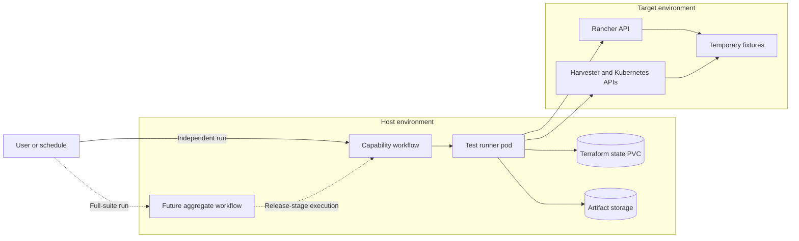

# Test Suite Architecture

## Purpose

The Harvester Upgrade Test Suite validates the Harvester and Rancher behavior
required by Open Cloud Datacenter after upgrades and configuration changes. It
uses Terraform to manage temporary fixtures and Go acceptance tests to verify
observable behavior.

The design is based on
[GitHub Discussion #242](https://github.com/wso2/open-cloud-datacenter/discussions/242).

## Environment boundary

The system uses two environment roles:

- The **Host** runs Argo Workflows, workflow pods, artifact storage, and future
  reporting services in a Rancher downstream Kubernetes cluster.
- The **Target** is the Harvester environment under test. The suite creates only
  temporary capability fixtures in it.



Workflow pods never run in the Target. This keeps execution, diagnostics, and
cleanup available when the Target is degraded.

## Component responsibilities

| Component | Responsibility |
|---|---|
| Capability workflow | Independently coordinates one capability's lifecycle and can be developed and submitted by its owning team |
| Aggregate workflow | At release stage, selects registered capabilities and invokes their workflow entrypoints |
| Shared workflow components | Provide reusable validation, locking, publication, and cleanup steps without owning capability behavior |
| Terraform | Creates and destroys temporary capability fixtures |
| Go runner | Executes API clients, behavioral assertions, and evidence collection |
| Capability module | Declares capability metadata, fixtures, tests, and evidence |
| Artifact store | Retains JUnit, JSON, logs, and redacted evidence |
| Janitor | Detects expired runs and retries cleanup after exceptional failures |

Terraform success is not treated as acceptance-test success. The Go assertion
layer must verify reconciliation, quota enforcement, API errors, runtime
behavior, and other outcomes that are not represented by Terraform state.

## Execution modes

### Independent capability execution

Each capability owns an Argo `WorkflowTemplate`. Teams submit that template
directly while developing or validating a capability. No aggregate workflow is
required, and failures in unrelated or incomplete capabilities cannot block the
team's feedback loop.

### Aggregate suite execution

At the initial release stage, an aggregate workflow will discover capability
metadata, select the requested modules, and invoke their published workflow
entrypoints. Any machine-readable catalog will be generated from the module
metadata rather than maintained as a shared contributor-edited file.
Aggregation adds ordering, concurrency, and suite-level reporting; it does not
replace the capability-owned workflows.

## Target capability run lifecycle

The complete lifecycle is listed below. CAP-002 currently implements input
validation, locking, Terraform provisioning, sanitized Terraform evidence
publication, and unconditional Terraform cleanup. It deletes the workspace PVC
after successful cleanup and retains it when the workflow fails.

1. Validate Target connectivity, versions, capacity, and required inputs.
2. Generate a unique run ID and acquire the required environment lock.
3. Initialize Terraform state on the capability workspace PVC.
4. Provision the selected capability fixtures.
5. Run bounded behavioral assertions.
6. Collect and redact diagnostics.
7. Publish the common result bundle.
8. Destroy all fixtures in an unconditional cleanup path.
9. Release the environment lock.
10. Let the janitor retry cleanup if the workflow terminated exceptionally.

## Architectural invariants

- Host and Target credentials are never committed or passed as ordinary workflow
  parameters.
- Every Target resource is associated with a unique run ID and expiry policy.
- Every external wait has an explicit deadline.
- Cleanup must eventually run after both provisioning and assertion failures.
  CAP-002 invokes Terraform destroy from an unconditional exit handler.
- Terraform state must not enter the evidence bundle. The initial CAP-002
  workflow stores it on a per-workflow Host-cluster PVC, deletes the claim after
  success, and retains it after failure for recovery.
- Evidence is redacted before publication.
- Every capability workflow remains independently runnable.
- A new capability does not require changes to another capability workflow.
- The aggregate workflow discovers capability metadata instead of using a
  hard-coded task list or hand-maintained central catalog.
- Development defaults must not be presented as production recommendations.

## Result contract

The complete result contract will publish:

```text
results/
├── junit.xml
└── result.json
evidence/
logs/
```

CAP-002 currently publishes the `evidence/terraform` portion of this contract:
run metadata, a sanitized plan summary, applied-resource inventory, and cleanup
status. JUnit, behavioral-test logs, and broader Kubernetes evidence are added
with the Go runner. The executable schema, retention rules, and broader evidence
redaction policy will be versioned at that point.
