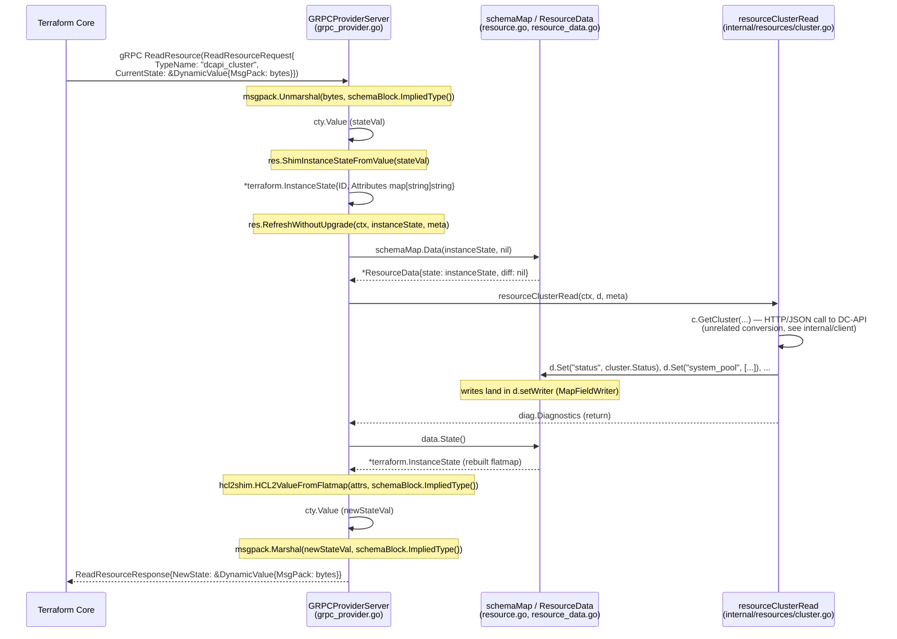
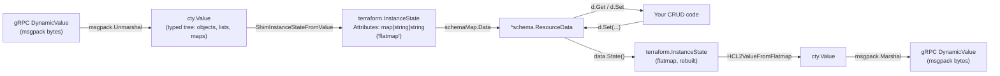
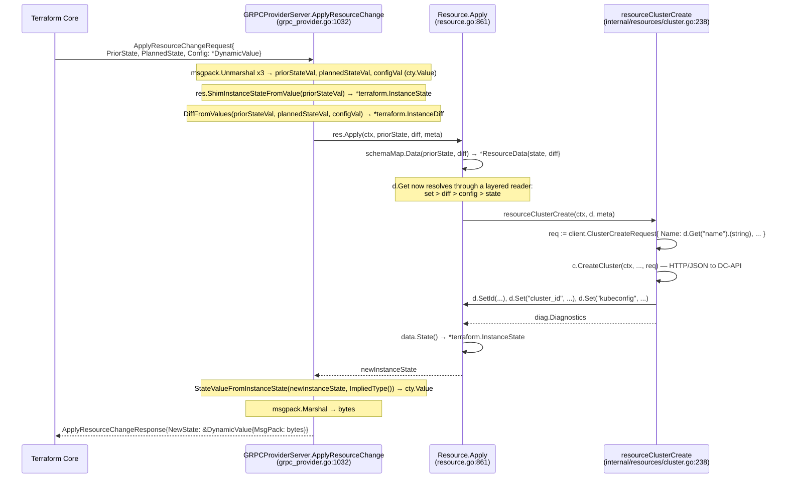
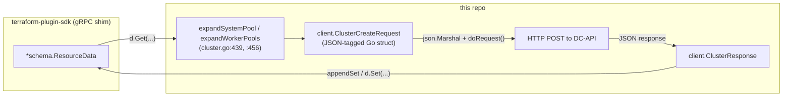

# How a gRPC Message Becomes a `ResourceData` (and Back)

## Scope note — read this first

This document is about the **Terraform plugin protocol**, not about this
provider's own calls to DC-API.

This repo's `internal/client` package talks to DC-API over plain **HTTP +
JSON** (`net/http`, `encoding/json` — see `internal/client/client.go`). There
is no gRPC, no `.proto` file, and no generated stub anywhere in this
repository's own code.

The gRPC that *does* exist in this stack is one layer further out: it's how
**Terraform Core** (the `terraform` binary) talks to **this provider binary**
(`terraform-provider-dcapi`). That protocol is defined in HashiCorp's
`tfplugin5.proto` / `tfplugin6.proto`, implemented for us by
`terraform-plugin-go` (the generated stubs) and `terraform-plugin-sdk/v2`
(the shim that turns those gRPC messages into the `*schema.ResourceData`
every `CreateContext`/`ReadContext`/etc. function receives).

```
Terraform Core  --gRPC (tfplugin5)-->  terraform-plugin-go  -->  terraform-plugin-sdk  -->  *schema.ResourceData  -->  this provider's cluster.go etc.
                                                                                                                              |
                                                                                                                              v
                                                                                                                 internal/client (HTTP + JSON) --> DC-API
```

Everything below traces the **first half** of that chain — gRPC message
↔ `ResourceData` — which lives entirely inside
`terraform-plugin-sdk/v2/helper/schema` (the package containing
`resource_data.go`, `grpc_provider.go`, `resource.go`, `schema.go`).

---

## 1. The moving parts

| Layer | Type | Where |
|---|---|---|
| Wire message | `*tfprotov5.ReadResourceRequest` / `*tfprotov5.ApplyResourceChangeRequest` (protobuf-generated, gRPC) | `terraform-plugin-go@.../tfprotov5` |
| Encoded value inside the message | `*tfprotov5.DynamicValue{ MsgPack []byte }` | same |
| Decoded dynamic value | `cty.Value` (typed per the resource's schema) | `github.com/hashicorp/go-cty/cty` |
| Legacy flat state | `*terraform.InstanceState{ ID, Attributes map[string]string }` | `terraform-plugin-sdk/v2/terraform` |
| What your CRUD code sees | `*schema.ResourceData` | `helper/schema/resource_data.go` |

`ResourceData` itself is just a bundle of these lower layers plus two
read/write helpers:

```go
// helper/schema/resource_data.go:26
type ResourceData struct {
    schema       map[string]*Schema
    config       *terraform.ResourceConfig
    state        *terraform.InstanceState   // prior state, from the gRPC request
    diff         *terraform.InstanceDiff    // planned changes, from the gRPC request
    meta         map[string]interface{}
    timeouts     *ResourceTimeout
    providerMeta cty.Value

    multiReader *MultiLevelFieldReader      // built lazily, see below
    setWriter   *MapFieldWriter             // built lazily, see below
    newState    *terraform.InstanceState
    ...
}
```

It never touches gRPC or `cty` directly in its public API — `Get`/`Set`
only know about `state`, `diff`, `config`, and a scratch `setWriter`. The
gRPC-facing conversion happens entirely in `grpc_provider.go`, one function
per RPC (`ReadResource`, `PlanResourceChange`, `ApplyResourceChange`, ...).

---

## 2. Read path: gRPC request → `ResourceData` → gRPC response

This is `GRPCProviderServer.ReadResource` (`helper/schema/grpc_provider.go:644`),
called every time Terraform refreshes state for a `dcapi_cluster` resource.



Key calls, with file:line references:

1. **Unmarshal the wire bytes into a typed value**
   `helper/schema/grpc_provider.go:676`
   ```go
   stateVal, err := msgpack.Unmarshal(req.CurrentState.MsgPack, schemaBlock.ImpliedType())
   ```
   `schemaBlock.ImpliedType()` is a `cty.Type` derived from the resource's
   `schema.Resource.Schema` map — it's what tells the msgpack decoder the
   shape (nested objects, lists, maps) to expect.

2. **Shim the typed value down to the legacy flat representation**
   `helper/schema/grpc_provider.go:682`
   ```go
   instanceState, err := res.ShimInstanceStateFromValue(stateVal)
   ```
   defined at `helper/schema/resource.go:686`. Internally this calls
   `terraform.NewInstanceStateShimmedFromValue` and then round-trips
   through a throwaway `ResourceData` just to normalize `TypeSet` hash
   indexes — a detail you don't need to reproduce, just be aware the shim
   isn't a single dumb copy.

3. **Build the real `ResourceData`**
   `helper/schema/resource.go:1106` (inside `RefreshWithoutUpgrade`)
   ```go
   data, err := schema.Data(s, nil)   // schemaMap.Data — helper/schema/schema.go:629
   ```
   ```go
   func (m schemaMap) Data(s *terraform.InstanceState, d *terraform.InstanceDiff) (*ResourceData, error) {
       return &ResourceData{schema: m, state: s, diff: d}, nil
   }
   ```
   This is the literal construction of the struct your CRUD code receives.
   Note `diff` is `nil` on a pure Read — there's no plan to reconcile
   against yet.

4. **Your code runs** — `r.read(ctx, data, meta)` calls
   `resourceClusterRead` (`internal/resources/cluster.go:312`), which calls
   `d.Get(...)` / `appendSet(diags, d, ...)` → `d.Set(...)`.

5. **Convert `ResourceData` back to the flat state**
   `helper/schema/resource_data.go:317`, `State()`. It walks every schema
   key, resolves the current value through `d.get(...)`, and re-encodes
   everything through a fresh `MapFieldWriter` into
   `terraform.InstanceState.Attributes` (a flat `map[string]string`).

6. **Flatmap → typed `cty.Value`**
   `helper/schema/grpc_provider.go:731`
   ```go
   newStateVal, err := hcl2shim.HCL2ValueFromFlatmap(newInstanceState.Attributes, schemaBlock.ImpliedType())
   ```

7. **Typed value → wire bytes → gRPC response**
   `helper/schema/grpc_provider.go:740`
   ```go
   newStateMP, err := msgpack.Marshal(newStateVal, schemaBlock.ImpliedType())
   resp.NewState = &tfprotov5.DynamicValue{MsgPack: newStateMP}
   ```

---

## 3. Why two intermediate shapes (`cty.Value` *and* flatmap)?

`ResourceData`/`InstanceState` predate `cty` and Terraform's modern type
system by years. Rather than rewrite the whole SDK, HashiCorp bolted a
translation layer on each side:



The **flatmap** in the middle is what lets `d.Get("system_pool.0.size")`-style
dotted/indexed keys work — a nested block like `system_pool` (a `TypeList`
with `MaxItems: 1` containing `size`/`count`/`disk_gb`) is stored as:

```
system_pool.#          = "1"
system_pool.0.size     = "medium"
system_pool.0.count    = "3"
system_pool.0.disk_gb  = "80"
```

and a repeated nested block like `worker_pools[i].taints[j]`
(`internal/resources/cluster.go:96-168`) becomes:

```
worker_pools.#                     = "1"
worker_pools.0.name                = "workers"
worker_pools.0.taints.#             = "1"
worker_pools.0.taints.0.key         = "dedicated"
worker_pools.0.taints.0.effect      = "NoSchedule"
worker_pools.0.labels.%             = "2"
worker_pools.0.labels.team          = "platform"
```

(`#` = list length, `%` = map length — this is the classic Terraform
"flatmap" convention.) `cty.Value` on the gRPC side has no such flattening —
it's a genuine nested tree — so the flatmap conversion is exactly the
"expand/flatten" work every provider author is used to writing by hand for
lists and maps, except the SDK does one generic pass of it automatically to
go from `cty.Value` to flatmap. Your resource code (`expandSystemPool`,
`expandWorkerPools` in `cluster.go`) then does a *second*, resource-specific
expand/flatten between the flatmap-backed `ResourceData` and your own
`client.ClusterCreateRequest` JSON struct — that part is this provider's
code, not the SDK's.

---

## 4. Write path: gRPC `ApplyResourceChange` (Create/Update/Delete)

Apply is the same shape as Read but carries **three** values instead of one
— prior state, planned state, and config — and builds a real `diff` instead
of passing `nil`. This is what makes planned-but-not-yet-applied values
(e.g. a computed `cluster_id` that doesn't exist yet) visible to `d.Get`
during `Create`.



Relevant code:

- `helper/schema/grpc_provider.go:1046-1098` — unmarshal all three
  `DynamicValue`s and compute the diff (`DiffFromValues`, or a synthetic
  destroy diff if `plannedStateVal.IsNull()`).
- `helper/schema/resource.go:861` (`Resource.Apply`) — builds
  `data, _ := schema.Data(s, d)` (same `schemaMap.Data` as the Read path,
  just with a non-nil `diff` this time), then dispatches to
  `r.create` / `r.update` / `r.delete` depending on the diff
  (`resource.go:900-925` handles the destroy/recreate/create branches).
- Your provider's `resourceClusterCreate`
  (`internal/resources/cluster.go:238`) is `r.create`'s target — it reads
  planned values with `d.Get`, calls out over **HTTP/JSON** to DC-API via
  `client.DCAPIClient` (a completely separate conversion, see §5), then
  writes computed results back with `d.Set`/`d.SetId`.
- `helper/schema/grpc_provider.go:1175` —
  `StateValueFromInstanceState(newInstanceState, schemaBlock.ImpliedType())`
  turns the resulting flatmap back into a `cty.Value` for the response
  (this is the Apply-path counterpart of `HCL2ValueFromFlatmap` used on
  the Read path — same idea, different helper name).

---

## 5. Where this provider's own code fits in

Everything above happens *before* your `CreateContext`/`ReadContext`
function body even starts, and *after* it returns. Inside the function
body, this provider does a second, independent conversion that has nothing
to do with gRPC:



So the full, honest picture spans two unrelated protocols:

```
Terraform Core  <--gRPC (tfplugin5, msgpack)-->  ResourceData  <--Go function call-->  cluster.go  <--HTTP + JSON-->  DC-API
                 \_____________ SDK-internal, documented above ____________/          \_____ this repo's client.go _____/
```

If you're debugging a value that looks wrong in `terraform plan`/`apply`,
the first half (gRPC↔ResourceData) is where SDK bugs or schema mismatches
(wrong `Type`, missing `Elem`, forgetting `Computed`) would show up. The
second half (ResourceData↔DC-API JSON) is where this provider's own
`expand*`/`d.Set` code can go wrong — those are two separate places to
look, even though both feel like "the same struct" from inside a CRUD
function.
